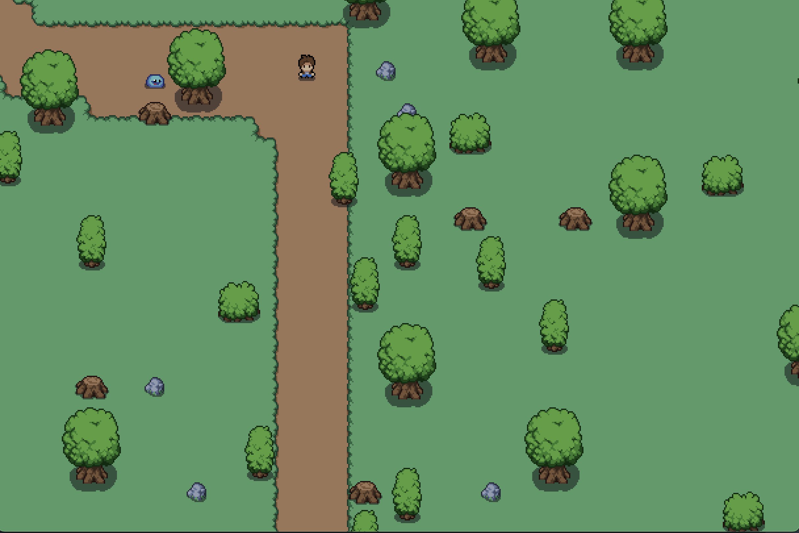

# Godot_learn_demo
> 游戏效果
- 游戏截图

# 基础知识
> 基础学习
1. [basic learn](https://kidscancode.org/godot_recipes/3.x/g101/index.html)
2. [gdscript learn](https://docs.godotengine.org/en/latest/tutorials/scripting/gdscript/gdscript_basics.html)

# 分支介绍
| 分支                                                                        | 说明    |
|---------------------------------------------------------------------------|-------|
| [demo/RPG](https://github.com/LikeRainDay/godot_learn_demo/tree/demo/RPG) | RPG游戏 |
| [demo/shader](https://github.com/LikeRainDay/godot_learn_demo/tree/demo/shader)| 着色器学习 |